# Best Cine

## Título do Projeto

**Best Cine** - Plataforma de Reserva de Ingressos de Cinema

## Descrição do Projeto

O **Best Cine** é uma aplicação completa de gerenciamento de cinema e reservas de ingressos. O sistema permite que os usuários naveguem por um catálogo de filmes, visualizem sessões disponíveis, selecionem assentos interativamente em uma sala virtual e realizem a reserva de ingressos. Este projeto resolve o problema de filas e gerenciamento manual, oferecendo uma experiência de compra de ingressos moderna, rápida e intuitiva.

O projeto vai além do básico e implementa conceitos avançados de arquitetura e integração de sistemas:

## 💳 Sistema de Pagamentos Escalável

A integração com o **Stripe** foi desenhada para alta disponibilidade e segurança:

- **Processamento Assíncrono**: O checkout não termina na requisição do usuário. Utilizamos **Workers** rodando em containers Docker dedicados que consomem filas no **Redis**. Isso garante que o usuário não fique "travado" esperando o processamento bancário.
- **Webhooks Seguros**: A confirmação do pagamento é recebida via Webhook do Stripe. Implementamos validação de assinatura para garantir a autenticidade da requisição.
- **Metadata**: Dados críticos do pedido são trafegados de forma segura através de metadados criptografados nas transações, garantindo a integridade do checkout mesmo em cenários de falha.

## 🌐 Integração com APIs Externas (RestAPI)

O sistema consome a API do **TMDB (The Movie Database)** para manter o catálogo atualizado.

- **Service Layer**: Foi implementado um Service Pattern (`TmdbService`) que atua como uma camada de abstração entre a aplicação e a API externa. Isso isola a lógica de negócios da complexidade das requisições HTTP, facilitando testes e manutenção.

## Tecnologias Usadas

O projeto foi construído utilizando tecnologias modernas e práticas robustas de desenvolvimento:

- **Linguagem**: PHP 8.2+
- **Framework Backend**: [Laravel 12.0](https://laravel.com)
- **Banco de Dados**: PostgreSQL 17
- **Cache & Filas**: Redis
- **Frontend**: Blade Templates, Tailwind CSS, Vite
- **Ambiente de Desenvolvimento**: Docker (via Laravel Sail)
- **Testes**: [PEST Framework](https://pestphp.com)
- **Pagamentos**: Stripe SDK
- **Autenticação**: Laravel Breeze / Sanctum

## Instalação

Siga os passos abaixo para rodar o projeto localmente utilizando Docker (Sail).

### Pré-requisitos

- Docker Desktop instalado e rodando.
- Terminal com suporte a Git.

### Passo a Passo

1. **Clone o repositório**:

    ```bash
    git clone https://github.com/MarcosMMarques/BestCine.git best-cine
    cd best-cine
    ```

2. **Configure o Ambiente**:

    ```bash
    cp .env.example .env
    ```

3. **Instale as Dependências**:
   Utilizando um container Docker temporário para não depender de PHP local:

    ```bash
    docker run --rm \
        -u "$(id -u):$(id -g)" \
        -v "$(pwd):/var/www/html" \
        -w /var/www/html \
        laravelsail/php82-composer:latest \
        composer install --ignore-platform-reqs
    ```

4. **Suba os Containers (Alias)**:
   Recomenda-se configurar um alias para o Sail ou usar o caminho completo:

    ```bash
    alias sail='[ -f sail ] && bash sail || bash vendor/bin/sail'
    sail up -d
    ```

5. **Configuração Final**:
   Gere a chave da aplicação, execute as migrações e popule o banco de dados:

    ```bash
    sail artisan key:generate
    sail artisan migrate --seed
    ```

6. **Frontend (Build)**:

    ```bash
    sail npm install
    sail npm run dev
    ```

Acesse a aplicação em: `http://localhost`

## Estrutura do Projeto

O projeto segue as convenções do Laravel, adotando o padrão **MVC (Model-View-Controller)** como base, mas estendendo-o com **Service Layer** e **Job Queues** para manter o código limpo, testável e escalável.

### 📂 Organização de Arquivos

```text
.
├── app/
│   ├── Enums/            # Enumerações PHP (ex: Status de Reserva)
│   ├── Http/
│   │   ├── Controllers/  # Lógica de controle de fluxo (MVC)
│   │   └── Middleware/   # Filtros de requisição HTTP
│   ├── Jobs/             # Classes de tarefas assíncronas (Redis)
│   ├── Models/           # Modelos Eloquent (ORM)
│   └── Services/         # Lógica de negócio complexa e integrações (TMDB)
├── bootstrap/            # Scripts de inicialização do framework
├── config/               # Arquivos de configuração global
├── database/
│   ├── factories/        # Modelos para geração de dados fake
│   ├── migrations/       # Controle de versão do esquema do banco
│   └── seeders/          # Populadores iniciais do banco
├── public/               # Ponto de entrada web (index.php) e assets compilados
├── resources/
│   ├── css/              # Estilos não processados (Tailwind)
│   └── views/            # Templates HTML (Blade)
├── routes/
│   ├── web.php           # Definição de rotas para o navegador
│   └── api.php           # Definição de rotas para APIs/Webhooks
├── tests/                # Suíte de testes automatizados (PEST)
├── compose.yaml          # Orquestração dos containers (Docker)
└── composer.json         # Gerenciador de dependências PHP
```

### 🧩 Diretórios Principais

- **`app/`**: Aqui se tem toda a lógica de negócio. Regras de negócio em `Services` e processamento assíncrono em `Jobs`, mantendo os `Controllers` leves.
- **`config/`**: Contém todas as configurações da aplicação. Destaque para `auth.php` (segurança) e `services.php` (chaves de API de terceiros como Stripe e TMDB).
- **`database/`**: Essencial para a consistência dos dados. As `migrations` garantem que o esquema do banco seja reprodutível em qualquer ambiente, enquanto `seeders` e `factories` permitem subir um ambiente de desenvolvimento populado em segundos.
- **`resources/`**: A camada de visualização. Utiliza-se Blade e componentes TailwindCSS para criar uma interface modular e reutilizável.
- **`tests/`**: A pasta contém Unit Tests e Feature Tests escritos em PEST, cobrindo fluxos críticos como checkout e autenticação.

### 📄 Arquivos Importantes

- **`.env`**: Arquivo crítico (não versionado) onde residem segredos como senhas de banco, chaves do Stripe e API Keys. **Nunca comite este arquivo.**
- **`compose.yaml`**: Define a infraestrutura como código. Descreve os serviços (App, Postgres, Redis, Mailpit) que o Docker deve subir.
- **`composer.json`**: O mapa das dependências de backend. Define as bibliotecas que o projeto precisa para rodar.

## Endpoints e Funcionalidades Principais

O projeto é focado em renderização server-side (Blade), com as seguintes rotas principais:

- **GET /** (`movies.index`): Página inicial listando os filmes em cartaz.
- **GET /movies/{id}** (`movies.show`): Exibe detalhes do filme, sinopse, elenco e trailer.
- **GET /movies/{movie}/sessions** (`movies.sessions`): Tela para escolha de dias e horários das sessões.
- **POST /reservation/checkout/{movie}** (`reservation.checkout`): Processa a reserva e o "pagamento" dos ingressos.
- **GET /profile**: Gerenciamento de perfil do usuário e visualização de tickets.

## Autenticação e Segurança

A segurança dos dados dos usuários é prioridade. O sistema implementa uma camada de autenticação robusta utilizando o ecossistema Laravel:

- **Guard Web (Session-Based)**: Para a interface do navegador, utilizando autenticação baseada em cookies de sessão seguros.
- **CSRF Protection**: Todas as requisições de formulários (`POST`, `PUT`, `DELETE`) são protegidas automaticamente contra Cross-Site Request Forgery via tokens validados no middleware.
- **Middleware de Autorização**: As rotas sensíveis (Checkout, Perfil) são protegidas por middlewares que garantem que apenas usuários autenticados e com permissões adequadas possam acessá-las.

## Testes

O projeto utiliza **PEST** para testes unitários e de feature.

Para rodar os testes:

```bash
sail artisan test
```

Ou diretamente via binário do Pest:

```bash
sail bin pest
```

## Exemplo de Uso

1. **Navegação**: Abra a página inicial e clique no poster de um filme do seu interesse.
2. **Detalhes**: Veja a sinopse e clique em "Ver Sessões" ou "Reservar".
3. **Sessão**: Escolha a data de hoje ou próxima data disponível.
4. **Seleção de Assentos**: Um mapa interativo da sala será exibido. Clique nos assentos desejados.
5. **Checkout**: Confirme o pedido. Se não estiver logado, será redirecionado para o Login. Após o login, você finalizará a "compra".
6. **Sucesso**: Uma tela de confirmação exibirá os detalhes do seu pedido.

## Documentação de Banco de Dados

Esta seção descreve como os dados estão organizados no sistema, focando no fluxo de negócio para facilitar o entendimento:

### 🎭 Catálogo de Filmes

Tudo começa com os **Filmes (Movies)**. Eles são a entidade central do catálogo, contendo informações como título, sinopse, duração e poster. Para enriquecer os detalhes, os filmes se relacionam com outras tabelas auxiliares:

- **Gêneros (Genres)**: Categorias do filme (Ação, Drama, etc).
- **Atores (Actors)**: O elenco do filme.
- **Produtoras (Production Companies)**: Estúdios responsáveis.

### 🎬 Exibição (Salas e Sessões)

Para um filme ser assistido, ele precisa ser exibido em algum lugar e horário:

- **Salas (Rooms)**: Representam o espaço físico do cinema. Cada sala tem um nome e uma capacidade total.
- **Sessões (Sessions)**: É o cruzamento entre um **Filme** e uma **Sala** em um horário específico (`datetime`). Quando o usuário navega no site, ele busca por sessões disponíveis.

### 🎟️ O Processo de Compra

O fluxo principal de negócio conecta o usuário à exibição:

1. **Usuários (Users)**: Clientes cadastrados na plataforma.
2. **Assentos (Seats)**: Lugares individuais dentro de uma sala. Durante a compra, o usuário seleciona quais assentos livres deseja ocupar naquela sessão.
3. **Reservas (Reservations)**: Representa a intenção de compra. Ela vincula o Usuário à Sessão e agrupa os Assentos selecionados. O status da reserva gerencia o ciclo de vida (pendente, confirmada, cancelada).
4. **Pedidos (Orders)**: A confirmação financeira. Após o pagamento ser processado (Stripe), um Pedido é gerado vinculado à Reserva, armazenando os valores finais, IDs de transação e status do pagamento.

Esse modelo garante que o histórico de compras seja preservado e que a ocupação das salas seja gerenciada em tempo real.

### 📐 Diagrama ER (Entity-Relationship)


